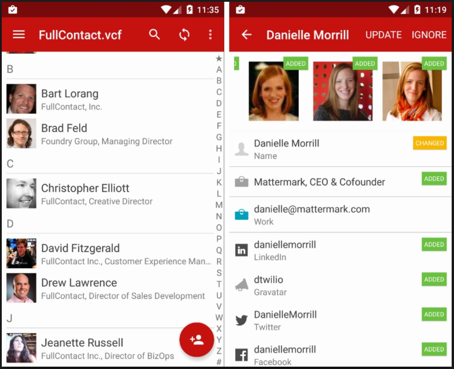
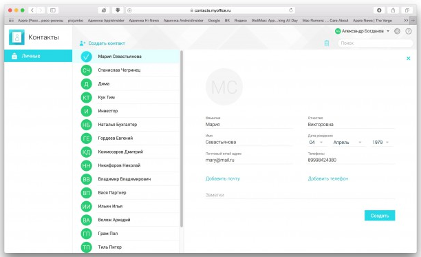

# Обзор аналогов
---

# Содержание 
1 [Обзор приложений](#application_overview)  
1.1 [FullContact](#fullcontact)  
1.2 [DaData](#DaData)  
1.3 [МойОфис Контакты](#myoffice)    
2 [Сравнение приложений](#comparison_of_applications)

<a name="application_overview"/>

# 1 Обзор приложений

<a name="fullcontact"/>

## 1.1 FullContact
**Русский интерфейс:** есть  
**Цена:** 10$ в месяц

Окно FullContact.  
  

FullContact — это адресная книга со всеми бизнес-контактами, способная автоматически обновлять их, добавляя информацию из социальных профилей и фотографии, а затем синхронизируя их в облаке. Необходимо авторизоваться в сервисе со своей контактной книгой, а также через социальные аккаунты, затем FullContact их упорядочит и удалит дубликаты.   
    
Ключевые особенности FullContact:   
    
- Двусторонняя синхронизация с Google или iCloud (каждые 24 часа или в реальном времени).   
- Удаление дубликатов и чистка контактов.   
- Объединение контактов из нескольких источников.   
- Ежемесячные обновления.   
- Транскрипции визитных карточек.   
- Прикрепление заметок.   
- Экспорт контактов на телефон, в контакты Google и др.   
- Оффлайн-режим.    
- Поддержка пользовательских полей и доменов Salesforce.    
- Сканирование односторонних и двусторонних карт.   
- Просмотр обновлений статуса в реальном времени.   

Программа не имеет встроенной справки.    

<a name="DaData"/>

## 1.2 DaData
**Русский интерфейс:** есть  
**Цена:** 5-10 копеек за запись  

DaData — это сервис, который приведет в порядок базу клиентов: удалит дублированные записи, привяжет адреса к ФИАС, исправит опечатки в адресах, ФИО и телефонах. «Подсказки» помогут людям набрать без опечаток адреса и реквизиты организаций, определить пол для ФИО. Подходит любому бизнесу, который обрабатывает контактные данные: интернет-магазинам, курьерским службам, коллекторам, банкам.  

Программа не имеет встроенной справки.  

<a name="myoffice"/>

## 1.3 МойОфис Контакты
**Русский интерфейс:** есть  
**Цена:** бесплатный

Окно МойОфис Контакты.  
  

МойОфис Контакты — это лёгкий сервис для работы с адресной книгой и контактами. Он входит в пакет «МойОфис», а поэтому работает совместно с почтовым приложением.   

Возможности сервиса:

- Добавление, редактирование и удаление контактов.
- Поиск по контактам.
- Добавление личных данных.
- Телефоны.
- Почтовые адреса.
- Заметки.

Программа не имеет встроенной справки.  

<a name="comparison_of_applications"/>

# 2 Сравнение приложений

| Функция | FullContact | DaData | МойОфис Контакты |
|:---|:---:|:---:|:---:|
| Поддержка русского языка | + | + | + |
| Бесплатное использование | - | - | + |
| Фильтрация по комбинациям ключевых слов | - | - | - |
| Встроенная справка | - | - | - |
| Простота использования | - | - | + |
