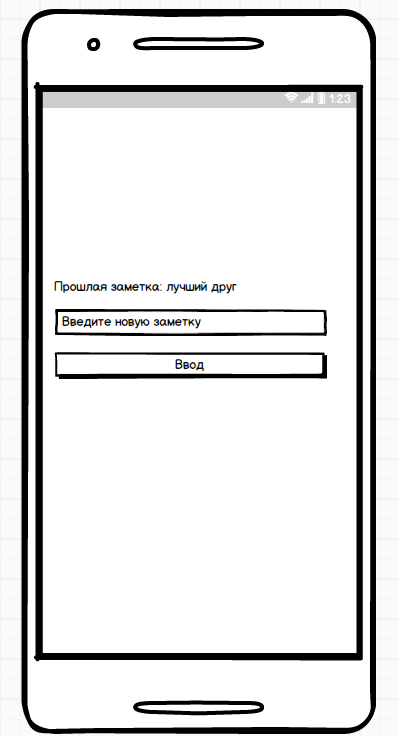
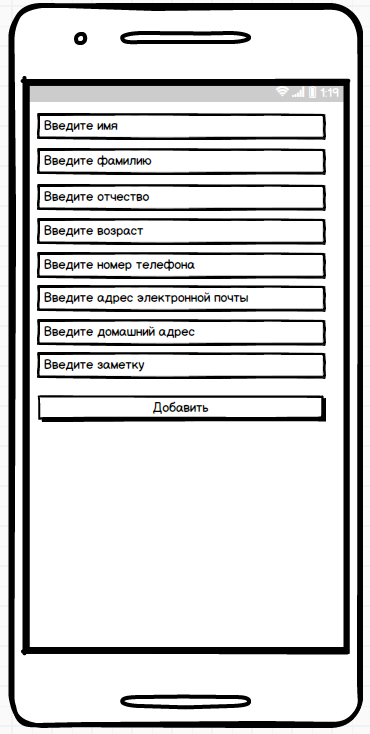

# Требования к проекту
# Адресная книга
---

# Содержание
1 [Введение](#intro)  
1.1 [Назначение](#appointment)  
1.2 [Бизнес-требования](#business_requirements)  
1.2.1 [Исходные данные](#initial_data)  
1.2.2 [Возможности бизнеса](#business_opportunities)  
1.2.3 [Границы проекта](#project_boundary)  
1.3 [Аналоги](#analogues)  
2 [Требования пользователя](#user_requirements)  
2.1 [Программные интерфейсы](#software_interfaces)  
2.2 [Интерфейс пользователя](#user_interface)  
2.3 [Характеристики пользователей](#user_specifications)  
2.3.1 [Классы пользователей](#user_classes)  
2.3.2 [Аудитория приложения](#application_audience)  
2.3.2.1 [Целевая аудитория](#target_audience)  
2.3.2.1 [Побочная аудитория](#collateral_audience)    
3 [Системные требования](#system_requirements)  
3.1 [Функциональные требования](#functional_requirements)  
3.1.1 [Основные функции](#main_functions)  
3.1.1.1 [Вход пользователя в приложение](#user_logon_to_the_application)  
3.1.1.2 [Настройка профиля пользователя](#setting_up_the_profile_of_the_user)  
3.1.1.3 [Настройка параметров поиска](#setting_search_options)  
3.1.1.4 [Загрузка списка контактов](#download_contact_list)  
3.2 [Нефункциональные требования](#non-functional_requirements)  
3.2.1 [Атрибуты качества](#quality_attributes)  
3.2.1.1 [Требования к удобству использования](#requirements_for_ease_of_use)  
3.2.2 [Внешние интерфейсы](#external_interfaces)  

<a name="intro"/>

# 1 Введение

<a name="appointment"/>

## 1.1 Назначение
В этом документе описаны функциональные и нефункциональные требования к приложению «Адресная книга». Этот документ предназначен для команды, которая будет реализовывать и проверять корректность работы приложения. 

<a name="business_requirements"/>

## 1.2 Бизнес-требования

<a name="initial_data"/>

### 1.2.1 Исходные данные
Группы людей, чья деятельность связанна с общением с большим количеством людей, сталкиваются с проблемой поиска контактов в зависимости от их деятельности или принадлежности к той или иной группе, организации. Большинство приложений предлагают разбиение на группы, что обычно связанно с созданием большого количества групп, что довольно неудобно.

<a name="business_opportunities"/>

### 1.2.2 Возможности бизнеса
Многие люди,общающиеся с большим количеством людей, желают иметь приложение, которое позволит им тратить меньше времени на поиск необходимых контактов и информации о них в зависимости от определенных признаков. Приложение расчитано на пользователей обладающих малой технической грамотностью, дополнение приложения подробной инструкцией позволит нивелировать данный факт и тем самым увеличить количество пользователей.

<a name="project_boundary"/>

### 1.2.3 Границы проекта
Приложение «Адресная книга» позволит пользователям, на чьем устройстве установленно данное приложение, находить и просматривать информацию о контактах, отобранных согласно выбранным критериям.

<a name="analogues"/>

## 1.3 Аналоги
Обзор аналогов представлен в документе [Overview of analogues](../Requirements/Overview%20of%20analogues.md).

<a name="user_requirements"/>

# 2 Требования пользователя

<a name="software_interfaces"/>

## 2.1 Программные интерфейсы
Приложение взаимодействует с базой данных SQLite. 

<a name="user_interface"/>

## 2.2 Интерфейс пользователя
Главное окно приложения.  
  
Окно изменения заметки.  
  

Окно добавления контакта.

  

<a name="user_specifications"/>

## 2.3 Характеристики пользователей

<a name="user_classes"/>

### 2.3.1 Классы пользователей

| Класс пользователей | Описание |
|:---|:---|
| Владелец устройства | Пользователь, который общается с большим количеством людей. Имеет доступ к полному функционалу. |

<a name="application_audience"/>

### 2.3.2 Аудитория приложения

<a name="target_audience"/>

#### 2.3.2.1 Целевая аудитория
Люди, чья деятельность связана с общением с большим количеством людей, со средним или выше среднего уровнем образования, обладающие малой технической грамотностью.

<a name="collateral_audience"/>

#### 2.3.2.2 Побочная аудитория
Люди без среднего или выше среднего уровня образования, обладающие вышеперечисленными качествами.

<a name="system_requirements"/>

# 3 Системные требования

<a name="functional_requirements"/>

## 3.1 Функциональные требования

<a name="main_functions"/>

### 3.1.1 Основные функции

<a name="user_logon_to_the_application"/>

#### 3.1.1.1 Вход пользователя в приложение
**Описание.** Пользователь имеет возможность использовать приложение без создания собственного профиля.

| Функция | Требования | 
|:---|:---|
| Вход в приложение| Приложение должно предоставить пользователю возможность войти в приложение |

<a name="setting_up_the_profile_of_the_user"/>

#### 3.1.1.2 Настройка профиля пользователя
**Описание.** Пользователь имеет возможность редактировать списки контактов и ключевых фраз.
 
| Функция | Требования | 
|:---|:---|
| Добавление контактов | Приложение должно предоставить пользователю поля для ввода информации о контакте. Пользователь должен либо ввести данные и подвердить действие, либо отменить его |
| Удаление контактов | Пользователь имеет возможножность выделить контакт в списке контактов и удалить его |
| Добавление/редактирование заметок | Приложение должно предоставить пользователю возможность выбрать заметre и поле для её изменения/добавления. |

<a name="setting_search_options"/>

#### 3.1.1.3 Настройка параметров поиска
**Описание.** Пользователь имеет возможность редактировать параметры фильтра для поиска контактов.
**Требование.** Приложение должно предоставить пользователю поля для изменения параметров поиска.

<a name="download_contact_list"/>

#### 3.1.1.4 Загрузка списка контактов
**Описание.** После входа пользователя в приложение или после завершения радактирования профиля пользователем, или после настройки параметров поиска необходимо загрузить список контактов и информацию о них и отфильтровать их согласно параметрам поиска.

| Функция | Требования | 
|:---|:---|
| Загрузка контактов | Приложение должно загрузить список контактов и информацию о них из базы данных после входа пользователя в приложение или после завершения радактирования профиля пользователем |
| Фильтрация новостей | Приложение должно отфильтровать новости согласно параметрам поиска |

<a name="non-functional_requirements"/>

## 3.2 Нефункциональные требования

<a name="quality_attributes"/>

### 3.2.1 Атрибуты качества

<a name="requirements_for_ease_of_use"/>

#### 3.2.1.1 Требования к удобству использования
1. Доступ к основным функциям приложения не более чем за три шага;
2. Все функциональные элементы пользовательского интерфейса имеют названия, описывающие действие, которое произойдет при выборе элемента;

<a name="external_interfaces"/>

### 3.2.2 Внешние интерфейсы
Окна приложения удобны для использования различными категориями пользователей:
  * функциональные элементы контрастны фону окна.
